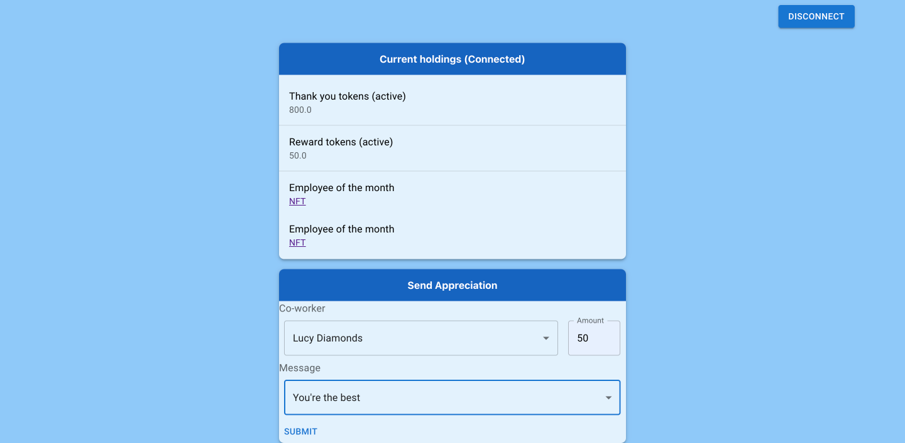

# Contract code

## Requirements

- python 3+
- [pipx](https://pypa.github.io/pipx/installation/)
- brownie
  - `pipx install eth-brownie`
- [Solidity compiler](https://docs.soliditylang.org/en/v0.8.11/installing-solidity.html)
- [Ganache](https://trufflesuite.com/ganache/)
- Metamask wallet plugin to interact with the front end
  - [For Chrome](https://chrome.google.com/webstore/detail/metamask/nkbihfbeogaeaoehlefnkodbefgpgknn)
  - [For firefox](https://addons.mozilla.org/en-US/firefox/addon/ether-metamask/)
- sqlite3 for the backend databse.  This is for testing purposes and should be switched to mysql or something similar
- To enable further use, the deployer needs to connect to the front end in order to:
  - Distribute thanks coins to addresses
- For employee of the month NFT
  - Pinata account with API keys
- Infura account with keys
- Etherscan account with keys

## Compile Solidity Contracts

`brownie compile`

## Deploy

#### Setup keys needed
Create a .env file within the current folder holding the the following:
```
export PRIVATE_KEY=<wallet_private_key>
export WEB3_INFURA_PROJECT_ID=<infura_id>
export ETHERSCAN_TOKEN=<etherscan_account_token>
export PINATA_API_KEY=<pinata_api_key>
export PINATA_SECRET_API_KEY=<pinata_secret_key>
export PINATA_JWT=<pinata_jwt>
```

#### Deploy on Ethereum mainnet
To deploy on other blockchains or testnets, replace `mainnet` with a value found from `brownie networks list`
```
brownie run ./scripts/deployRewards.py --network mainnet  
brownie run ./scripts/deployNFTs.py --network mainnet  
```


#### Run the website
Initialize the back end database.  This is currently using sqlite for testing.
- cd into ./api/src/db/
- `sqlite3 worker_rewards`
- `.quit`
- `sqlite3 worker_rewards.db < initialize_db.sql`
- Insert users and compliments into worker_rewards.db
  - For test purposes `sqlite3 worker_rewards.db < insert_tests.sql`

In two separate terminals or running instances:  
- Run the website from within ./front_end/
  - `npm start`
- Run the backend from within ./api/
  - `npm start`

## Unit Tests

Tests found in [test folder](./tests)  
  
`brownie test`

## Deployment build tests

### Locally on gnache

`brownie run ./scripts/deployRewards.py`

### Other testnets

`brownie run ./scripts/deployRewards.py --network rinkebey`  
`brownie run ./scripts/deployRewards.py --network ropsten`

### Deployed  
2022-02-07 V1 on ropsten test network:  
- [Deploy Address](https://ropsten.etherscan.io/address/0x839901c21D20316b0DDcA205AAe53A1EbB886cf4)
- [Swap](https://ropsten.etherscan.io/address/0xd9398D03794919215A2f7191e1FaBb4C9EeCBfdD)
- [Thank you token](https://ropsten.etherscan.io/address/0x131432D246122B94FeD14873C2c05A154EC93122)
- [Reward token](https://ropsten.etherscan.io/address/0x808cF232F973CF0bBB480C27d476E6C5581bbC62)
  
Costs:
- Deployment
  - 0.121760029128948 ($367) eth with gas at ~50 gwei  
- AddAddress
  - 0.000165667866 eth
- Distribute
  - 0.00025524 eth
- Send Thanks
  - Approve: 0.00005463063 eth
  - Send: 0.000184344972 eth

2022-02-17 V2  
fuji Avalanche test network:
- [Deploy Address](https://testnet.avascan.info/blockchain/c/address/0x839901c21D20316b0DDcA205AAe53A1EbB886cf4)
- [Swap](https://testnet.avascan.info/blockchain/c/address/0x7B652A331D18435ec0A60Bbde921b694e33dC8ea)
- [Thank you token](https://testnet.avascan.info/blockchain/c/address/0xC77E0748A0B611C7aF08a72fF855c5a431BB4a6C)
- [Reward token](https://testnet.avascan.info/blockchain/c/address/0x3D5597e5325eCeB2871A6132E680E0CCCc61204f)

Costs:
- Deployment
  - 0.0995 AVAX with gas at 25 gwei ($9)
  
ropsten test network:  
- [Deploy Address](https://ropsten.etherscan.io/address/0x839901c21D20316b0DDcA205AAe53A1EbB886cf4)
- [Swap](https://ropsten.etherscan.io/address/0xc1E8Aa5eDE71816FBbf68c19b149376D94B402F9)
- [Thank you token](https://ropsten.etherscan.io/address/0xd796e77A5d8CD6b5b958A670f3Af6Bb806A5184C)
- [Reward token](https://ropsten.etherscan.io/address/0xAfEf77aEa02Bb31FDB31dcd16ebBc39109F66FC7)
- [Employee of the month NFT](https://ropsten.etherscan.io/address/0x7e36dDF8bA3C44e71225F8270D36e6B636a77DED)
  
Costs:
- Deployment
  - 0.006700842103 with gas at 1.68 gwei, 0.199429824494048 at 50 gwei
- Distribute
  - 0.000214684501860599 with gas at 1.5 gwei, 0.00715615006202 at 50 gwei
- Send Thanks
  - Approve: 0.0000395055 at 1.5 gwei
  - Send: 0.000129334501207122 at 1.5 gwei, 
- Employee of the month NFT
  - Deploy: 0.00242994868111495 at 1.3 gwei gas
  - Mint: 0.000246784513490886 at 1.5 gwei gas

## Run front end

Make sure that there has been at least one deployment on a non-local blockchain.  
  
### Locally

#### Start the api backend
```
cd api
npm start
```

#### Start the webpage
```
cd front_end
npm start
```

## Tip the creator

#### In order to tip, send crypto to one of the following addresses  
- ETH (Ethereum):
  - 0x30D4C0b1cBBa1A31F04d921fCA45eb0edDC7A367
- AVAX (Avalanche):
  - 0x30d4c0b1cbba1a31f04d921fca45eb0eddc7a367

## Current front-end screenshot

### User account


### Admin account

