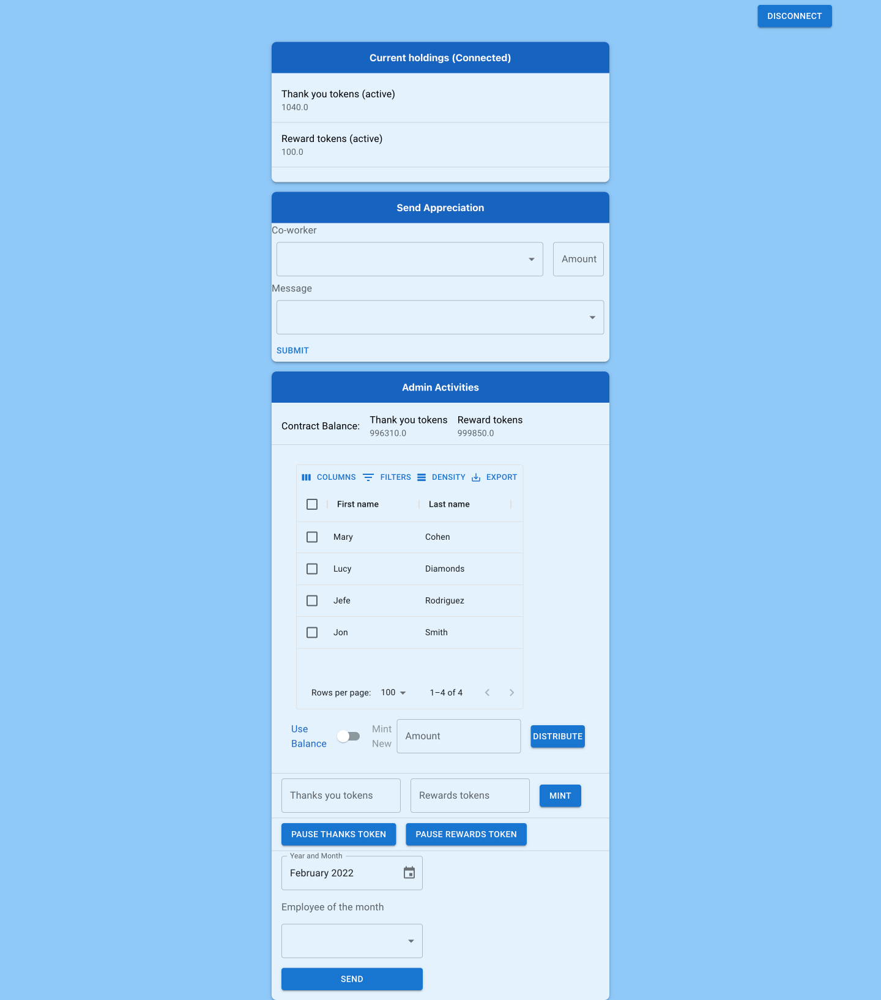

# Worker Rewards Front End

Make sure to deploy the ethereum smart contracts before running.
This adds the necessary contract info and deployment addresses to the front end for contract interaction.  
  
The back-end also needs to be started for this to work.  It is located in the ../api folder

- This project was bootstrapped with [Create React App](https://github.com/facebook/create-react-app).  
  - Error fix added to tsconfig.json in compiler options
    - "suppressImplicitAnyIndexErrors": true
- Metamask wallet connection was bootstrapped with [useDapp](https://usedapp.io/).  
  - [Error fix found here](https://github.com/mswjs/msw/issues/1030#issuecomment-1009253387)
- Style was with [Material UI](https://mui.com/getting-started/installation/)

## Run

`npm start`

## Current front-end screenshot

### User account

### Admin account

